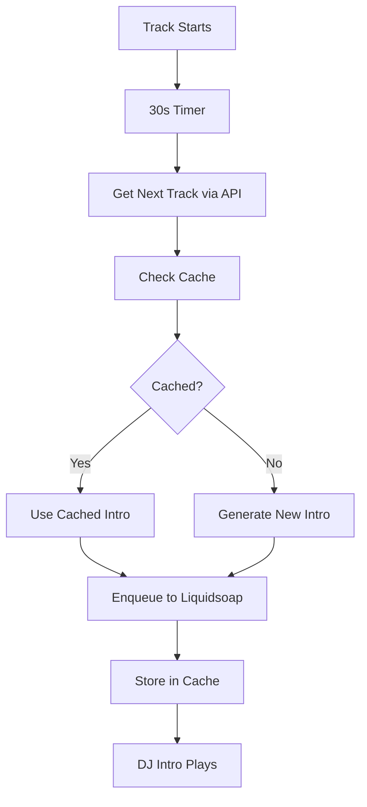

# AI Radio

An intelligent streaming platform that combines Liquidsoap audio automation with AI-powered DJ commentary and multiple TTS engines.

## Features

- **🎵 Automated Music Streaming**: Powered by Liquidsoap with intelligent queue management
- **🤖 AI DJ Commentary**: Contextual intros generated using Ollama models (default: llama3.2:3b)
- **🎙️ Multi-TTS Support**: XTTS, ElevenLabs, and Piper engines for high-quality speech synthesis
- **📱 Real-time Web Interface**: Live track display with album artwork and DJ status
- **⚡ Proactive Generation**: DJ intros generated ahead of time for seamless playback

## System Architecture

### Core Components

- **Liquidsoap Engine** (`radio.liq`): Audio streaming and queue management with telnet control on port 1234
- **Flask Web Application** (`ui/app.py`): REST API and real-time web interface on port 5055
- **AI Commentary System**: Uses Ollama for contextual DJ commentary generation
- **TTS Pipeline**: Multi-engine support with automatic fallback
- **Proactive Generation**: Timer-based system generates intros 30 seconds after track starts

### Directory Structure

```
/opt/ai-radio/
├── ui/                         # Flask web interface
│   ├── app.py                 # Main REST API server
│   └── index.html             # Real-time frontend
├── radio.liq                  # Liquidsoap configuration
├── efficient_dj_intro.py      # Proactive intro generation system
├── dj_enqueue_xtts.sh         # XTTS generation script
├── auto_dj.conf              # DJ automation settings
├── dj_settings.json          # TTS voices and templates
├── library_clean.m3u         # Music library playlist
├── tts/                      # Generated TTS files
├── cache/covers/            # Album artwork cache
├── logs/                    # Application logs
└── voices/                  # TTS voice models
```

## Installation & Setup

### Prerequisites

- Docker (for Liquidsoap container)
- Python 3.x with virtual environment
- Ollama for AI generation
- Optional: ElevenLabs API key

### Service Management

The system runs as two systemd services:

```bash
# Main radio service (Liquidsoap in Docker)
systemctl status ai-radio
systemctl restart ai-radio

# Web interface (Flask)
systemctl status ai-dj-ui  
systemctl restart ai-dj-ui
```

### Environment Variables

```bash
OLLAMA_MODELS="/mnt/music/ai-dj/ollama"    # Ollama model directory
XTTS_SPEAKER="Damien Black"                # Default XTTS voice
DJ_INTRO_MODE=1                            # Enable intro generation mode
USE_XTTS=1                                 # Enable XTTS engine
ELEVENLABS_API_KEY="your-key"              # Optional ElevenLabs API
```

## DJ Intro System

### How It Works

1. **Track Starts Playing** → 30-second timer begins
2. **Proactive Generation** → System generates intro for NEXT track
3. **Immediate Queueing** → Intro pushed to Liquidsoap TTS queue
4. **Automatic Playback** → Intro plays before next track starts

### Key Features

- **🎯 Accurate Track Detection**: Uses Flask API instead of telnet for reliability
- **⚡ Proactive Timing**: Generates intros during current track, not reactively
- **🎙️ Smart UI Display**: Shows DJ intros with microphone icons and actual transcript text
- **📝 Transcript Management**: Automatically saves and displays spoken text
- **🔄 Fallback Systems**: Multiple TTS engines with automatic switching

### Generation Process



## API Endpoints

### Core Endpoints

- `GET /api/now` - Currently playing track with metadata
- `GET /api/next` - Upcoming tracks (songs and DJ intros)
- `GET /api/history` - Play history with timestamps
- `GET /api/tts_queue` - Generated DJ intros with transcripts

### DJ System

- `POST /api/dj-next` - Manually generate intro for next track
- `GET /api/dj_status` - DJ generation status and history
- `POST /api/dj_status/clear` - Clear DJ generation history

### Controls

- `POST /api/skip` - Skip current track
- `POST /api/tts_queue` - Add custom TTS to queue

## Web Interface Features

### Real-time Display

- **🔴 LIVE NOW**: Current track with remaining time
- **⏭️ UPCOMING**: Next tracks with proper DJ intro identification
- **📀 JUST PLAYED**: Recent play history
- **🎙️ DJ COMMENTARY**: Generated intros with transcript text

### Visual Indicators

- **🎵 Songs**: Album artwork with artist • album format
- **🎙️ DJ Intros**: Microphone icon with blue accent and spoken text
- **⏰ Timestamps**: Real-time updates with precise timing

## Development

### Debugging Commands

```bash
# Check TTS queue status
echo -e "tts.queue\nquit" | nc 127.0.0.1 1234

# Monitor DJ generation
curl -s http://127.0.0.1:5055/api/dj_status | jq

# Check service logs  
journalctl -u ai-radio -f
journalctl -u ai-dj-ui -f

# Test intro generation
./efficient_dj_intro.py
```

### Configuration Files

- **Music Library**: Edit `library_clean.m3u`
- **DJ Settings**: Modify `dj_settings.json` for voices and templates
- **Auto DJ**: Configure `auto_dj.conf` for generation intervals

## Recent Improvements (v2024.08)

### DJ Intro System Overhaul

- **✅ Fixed Track Detection**: Switched from unreliable RID-based telnet queries to Flask API calls
- **✅ Proactive Generation**: Re-enabled timer-based system with immediate enqueueing
- **✅ UI Enhancement**: Added 🎙️ microphone icons and transcript display for DJ intros
- **✅ Reliability**: Eliminated telnet spam and improved error handling
- **✅ Performance**: Cached intro generation with intelligent fallbacks

### Technical Improvements

- **API Reliability**: `/api/next` now properly excludes current track and identifies DJ content
- **TTS Queue Management**: Simplified enqueueing with `file://` format instead of complex annotations
- **Real-time Updates**: Improved WebSocket-like polling for live UI updates
- **Error Handling**: Better timeout management and graceful fallbacks

## Troubleshooting

### Common Issues

1. **No DJ Intros Playing**
   - Check if `ai-radio` service is running
   - Verify proactive generation is enabled in `radio.liq`
   - Monitor logs: `journalctl -u ai-radio -f`

2. **TTS Generation Failures**
   - Check XTTS virtual environment: `xtts-venv/bin/python`
   - Verify speaker name in environment: `echo $XTTS_SPEAKER`
   - Test manually: `./dj_enqueue_xtts.sh "Artist" "Title"`

3. **Web UI Not Updating**
   - Restart Flask service: `systemctl restart ai-dj-ui`
   - Check port 5055 accessibility
   - Clear browser cache

### Service Dependencies

Both services must be running for full functionality:
- **ai-radio**: Handles audio streaming and TTS queue
- **ai-dj-ui**: Provides web interface and API endpoints

## License

[License information]

## Contributing

1. Follow existing code style and patterns
2. Test changes with both services running  
3. Update CLAUDE.md for AI assistant context
4. Document API changes in README

---

*AI Radio - Intelligent streaming with contextual DJ commentary*